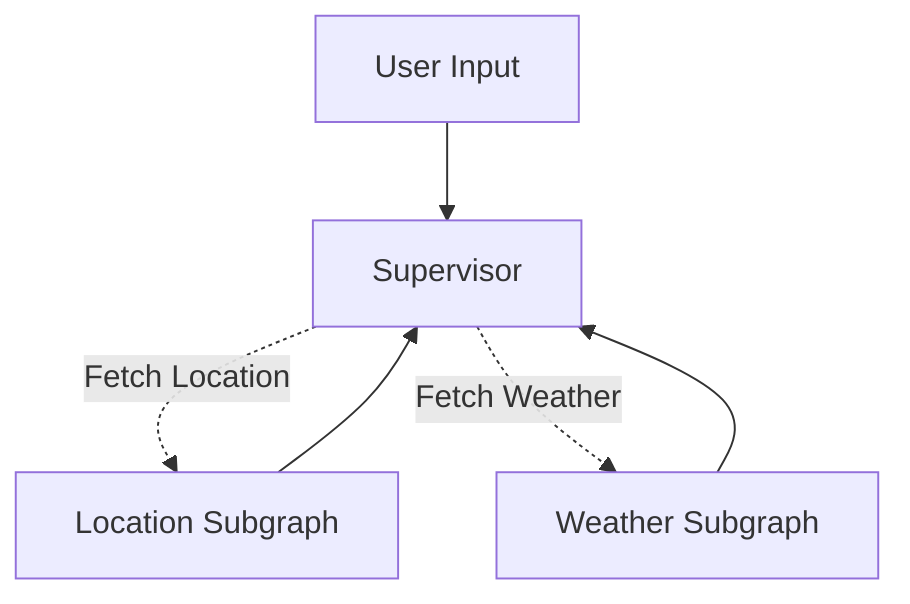

# Geo Weather Subagent 🌍🌦️

A hierarchical multi-agent system built with **LangGraph** that orchestrates location resolution and weather data retrieval using a **Supervisor-Subgraph** architecture.

## 🏗️ Architecture

The system uses a Supervisor node to delegate tasks to specialized subgraphs based on user input.

## ⚡ Tech Stack & APIs
- Orchestration: LangGraph & LangChain
- Geolocation: Geoapify API (Geocoding)
- Weather: wttr.in (JSON format)
